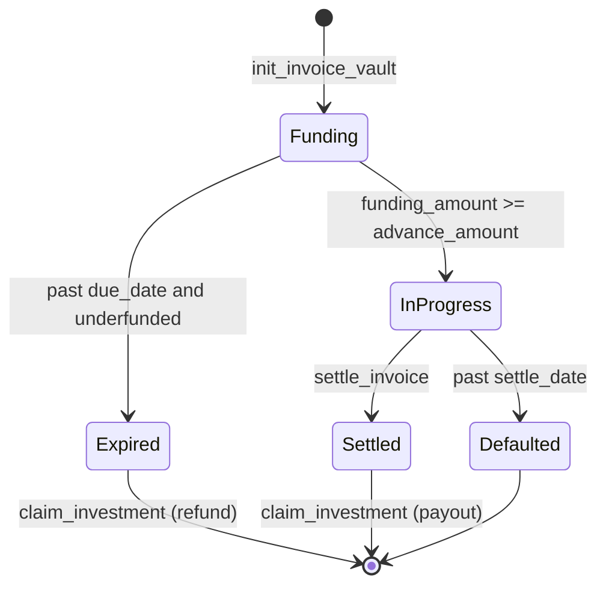
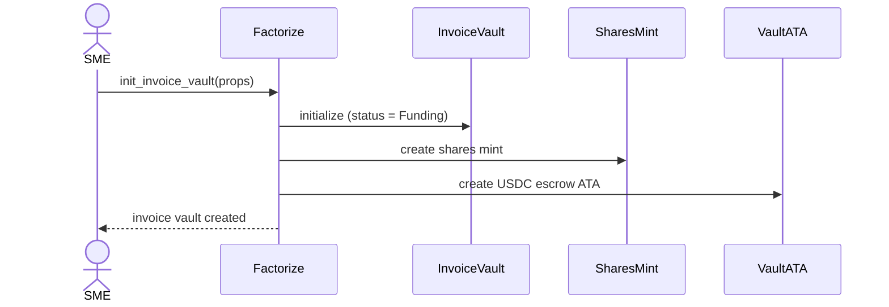
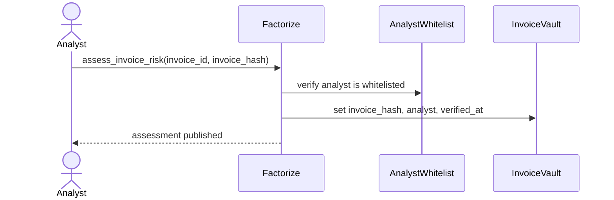
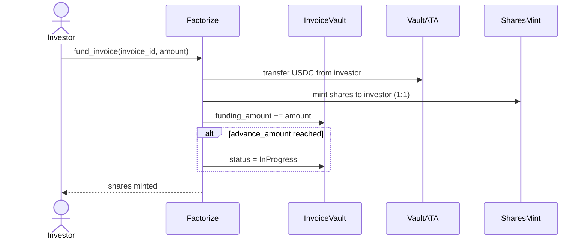
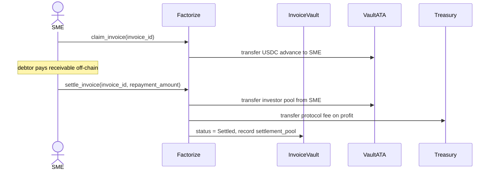
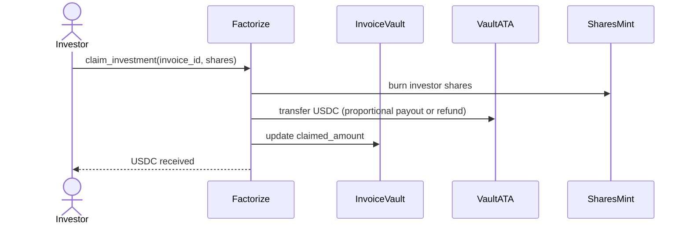

# Factorize

Factorize is an RWA protocol that lets investors earn yield on receivables from SMEs (small and medium enterprises).

The APY comes from the discount at which SMEs sell their receivables when they need immediate liquidity.

## On-chain accounts

| Account | PDA seeds | Description |
|---------|-----------|-------------|
| `Config` | `["config"]` | Protocol admin, treasury, USDC mint, protocol fee, and pause flag |
| `AnalystWhitelist` | `["analyst", analyst_pubkey]` | Marks a risk analyst as authorized to assess invoices |
| `InvoiceVault` | `["invoice_vault", sme, invoice_id]` | Per-invoice state: amounts, dates, status, analyst attestation |
| `shares` mint | `["shares", sme, invoice_id]` | SPL token representing each investor's position (1 share = 1 USDC funded) |
| `invoice_vault_ata` | ATA of `InvoiceVault` | USDC escrow for investor deposits, SME advance, and settlement payouts |

### `InvoiceVault` fields

- `advance_amount` — target funding (typically 80–95% of face value)
- `funding_amount` — USDC deposited by investors so far
- `repayment_amount` — full receivable value when the debtor pays
- `settled_share_supply` / `settlement_pool` / `claimed_amount` — used after settlement for proportional investor claims
- `due_date` — end of the funding window
- `settle_date` — deadline for debtor repayment
- `invoice_hash` / `analyst` / `verified_at` — risk assessment attestation

### `InvoiceStatus` lifecycle

Status transitions on `Funding` and `InProgress` are also applied automatically by `sync_invoice_status` (and by any instruction that touches the vault).

## Instructions

### Protocol setup (admin)

| Instruction | Signer | Description |
|-------------|--------|-------------|
| `init_config` | admin | One-time setup: treasury, USDC mint, protocol fee (bps), and pause flag |
| `add_analyst` | admin | Whitelist a risk analyst (`AnalystWhitelist` PDA) |
| `remove_analyst` | admin | Close an analyst's whitelist account |
| `set_paused` | admin | Pause or unpause the protocol |

### Invoice lifecycle

| Instruction | Signer | Required status | Description |
|-------------|--------|-----------------|-------------|
| `init_invoice_vault` | SME | — | Create an `InvoiceVault`, `shares` mint, and USDC escrow ATA |
| `assess_invoice_risk` | whitelisted analyst | `Funding` | Attach `invoice_hash` attestation; sets `analyst` and `verified_at` |
| `fund_invoice` | investor | `Funding` (assessed) | Transfer USDC into the vault; mint `shares` 1:1; moves to `InProgress` when fully funded |
| `claim_invoice` | SME | `InProgress` | SME withdraws the funded USDC advance from the vault |
| `settle_invoice` | SME | `InProgress` | SME repays into the vault; protocol fee sent to treasury; status → `Settled` |
| `claim_investment` | investor | `Funding`, `Expired`, or `Settled` | Burn `shares` and receive USDC (refund if expired/underfunded, proportional payout if settled) |
| `sync_invoice_status` | anyone | — | Permissionless keeper hook for `due_date` / `settle_date` transitions |

## User stories

### SME tokenizes an invoice

### Risk analyst publishes assessment

### Investor funds an invoice

### SME claims advance and settles

### Investors claim returns

