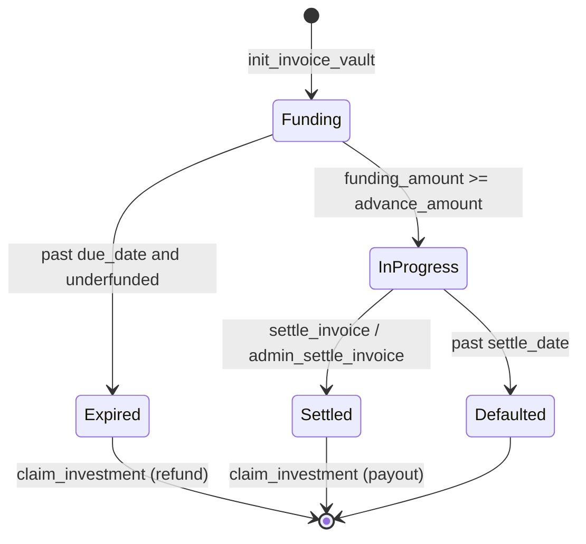
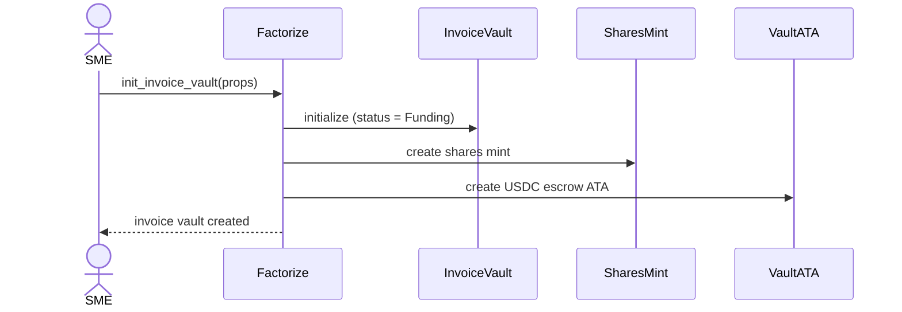
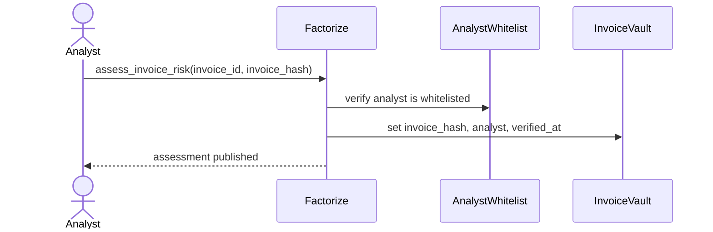
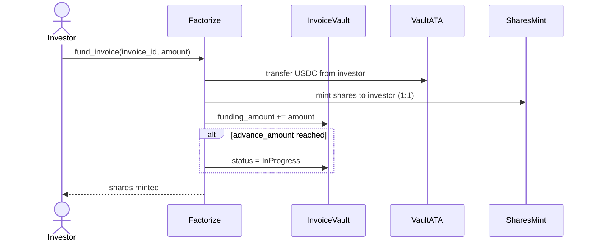
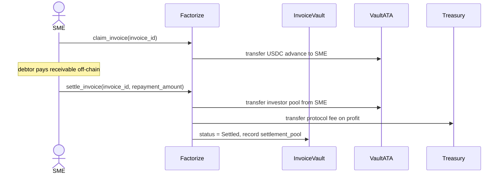
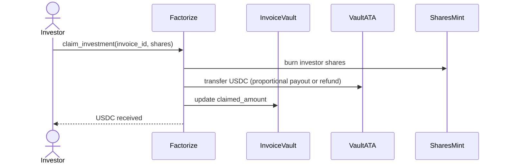
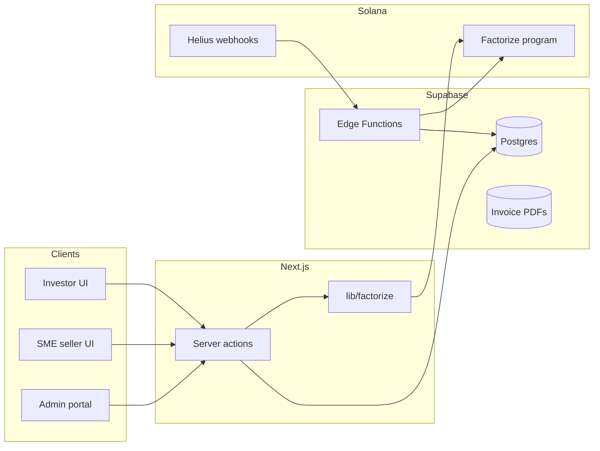
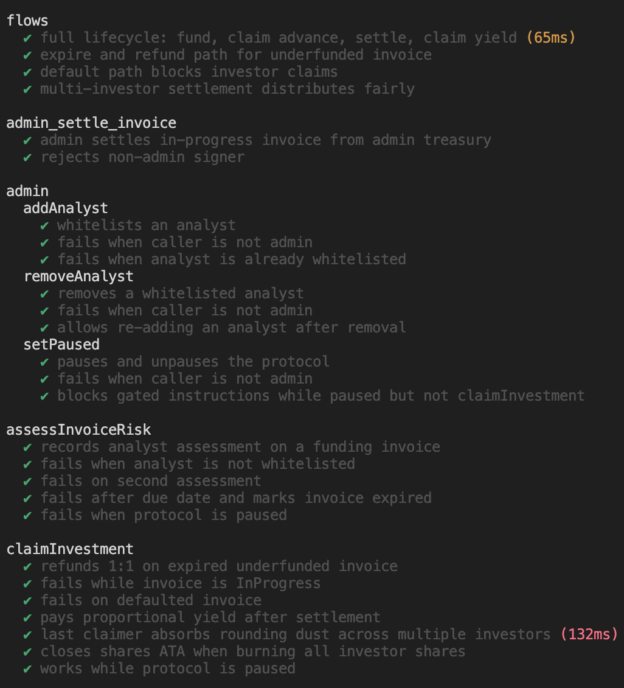
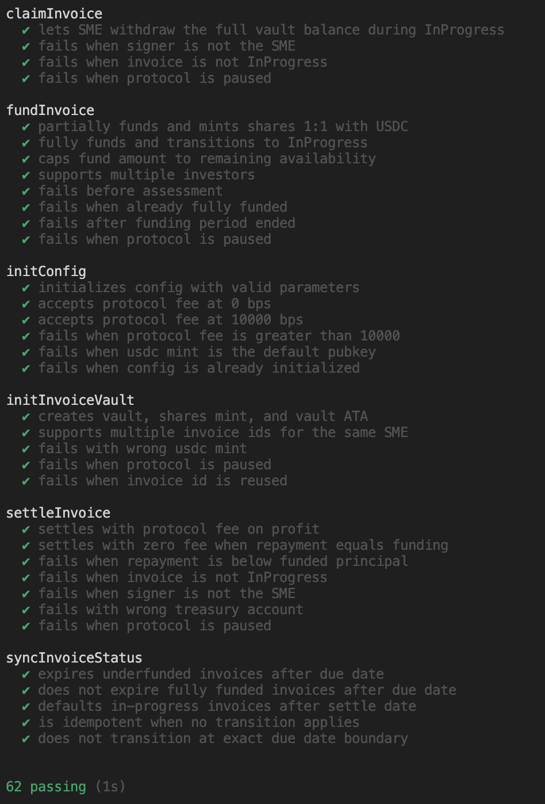

# Factorize

Factorize is an RWA protocol that lets investors earn yield on receivables from SMEs (small and medium enterprises).

The APY comes from the discount at which SMEs sell their receivables when they need immediate liquidity.

| Devnet |
|--------|
| `6YWgPX8CbreGMdPAkCnXxLG5xW9T8LiTQHqafP3C3GhT` |

## On-chain accounts

| Account | PDA seeds | Description |
|---------|-----------|-------------|
| `Config` | `["config"]` | Protocol admin, treasury, USDC mint, protocol fee, and pause flag |
| `AnalystWhitelist` | `["analyst", analyst_pubkey]` | Marks a risk analyst as authorized to assess invoices |
| `InvoiceVault` | `["invoice_vault", sme, invoice_id]` | Per-invoice state: amounts, dates, status, analyst attestation |
| `shares` mint | `["shares", sme, invoice_id]` | SPL token representing each investor's position (1 share = 1 USDC funded) |
| `invoice_vault_ata` | ATA of `InvoiceVault` | USDC escrow for investor deposits, SME advance, and settlement payouts |

### `InvoiceVault` fields

- `advance_amount` — target funding (typically 80–95% of face value)
- `funding_amount` — USDC deposited by investors so far
- `repayment_amount` — full receivable value when the debtor pays
- `settled_share_supply` / `settlement_pool` / `claimed_amount` — used after settlement for proportional investor claims
- `due_date` — end of the funding window
- `settle_date` — deadline for debtor repayment
- `invoice_hash` / `analyst` / `verified_at` — risk assessment attestation

### `InvoiceStatus` lifecycle



Status transitions on `Funding` and `InProgress` are also applied automatically by `sync_invoice_status` (and by any instruction that touches the vault).

## Instructions

### Protocol setup (admin)

| Instruction | Signer | Description |
|-------------|--------|-------------|
| `init_config` | admin | One-time setup: treasury, USDC mint, protocol fee (bps), and pause flag |
| `add_analyst` | admin | Whitelist a risk analyst (`AnalystWhitelist` PDA) |
| `remove_analyst` | admin | Close an analyst's whitelist account |
| `set_paused` | admin | Pause or unpause the protocol |

### Invoice lifecycle

| Instruction | Signer | Required status | Description |
|-------------|--------|-----------------|-------------|
| `init_invoice_vault` | SME | — | Create an `InvoiceVault`, `shares` mint, and USDC escrow ATA |
| `assess_invoice_risk` | whitelisted analyst | `Funding` | Attach `invoice_hash` attestation; sets `analyst` and `verified_at` |
| `fund_invoice` | investor | `Funding` (assessed) | Transfer USDC into the vault; mint `shares` 1:1; moves to `InProgress` when fully funded |
| `claim_invoice` | SME | `InProgress` | SME withdraws the funded USDC advance from the vault |
| `settle_invoice` | SME | `InProgress` | SME repays into the vault; protocol fee sent to treasury; status → `Settled` |
| `admin_settle_invoice` | admin | `InProgress` | Platform ops settles after off-chain payment verified; USDC from admin treasury |
| `claim_investment` | investor | `Funding`, `Expired`, or `Settled` | Burn `shares` and receive USDC (refund if expired/underfunded, proportional payout if settled) |
| `sync_invoice_status` | anyone | — | Permissionless keeper hook for `due_date` / `settle_date` transitions |

## User stories

### SME tokenizes an invoice



### Risk analyst publishes assessment



### Investor funds an invoice



### SME claims advance and settles



### Investors claim returns



---

## Product architecture

Factorize combines a Next.js app, Supabase (Postgres + Storage + Edge Functions), Helius webhooks, and the Solana program above.



### Seller vs payer

- **Seller (SME)** — wallet in `smes`; signs `init_invoice_vault`, `claim_invoice`; on-chain `InvoiceVault.sme`.
- **Payer** — debtor company in `companies` (canonical by RUC); shown to investors; assessed for risk. Same `companies` row can appear as payer on many invoices or as seller on another SME’s profile.

| Table | Role |
|-------|------|
| `companies` | Canonical entity (RUC, name, sector) |
| `smes` | Seller wallet + `company_id` FK |
| `invoices` | Off-chain mirror: payer, amounts, dates, vault PDAs, status |
| `analysts` / `invoice_assessments` | Risk queue and ratings |
| `chain_events` | Idempotent Helius event log |

`operation_type` is `factoring` or `confirming`. `invoice_hash` is SHA-256 of **canonical JSON** (see `lib/factorize/canonicalInvoiceHash.ts`), not the PDF.

### Indexing and keepers

1. **Primary:** Helius → `supabase/functions/helius-webhook` parses Anchor events (`lib/factorize/parseEvents.ts`) and upserts `invoices` / `chain_events`.
2. **Passive expiry:** `pg_cron` → `keeper-sync` sends permissionless `sync_invoice_status` for stale `Funding` / `InProgress` rows (requires `KEEPER_SECRET_KEY`).
3. **Reconciliation:** `reconcile-invoices` compares RPC vault accounts to DB (daily gap repair).

### Settlement (v1)

Off-chain payer pays the platform → ops marks `payment_verified_at` → admin signs `admin_settle_invoice` (USDC from admin treasury → vault + fee to protocol treasury). Investors then `claim_investment`. On-chain SME `settle_invoice` remains for a future `settle_onchain` path.

### Anchor events

Lifecycle instructions emit events consumed by the webhook: `InvoiceVaultInitialized`, `InvoiceRiskAssessed`, `InvoiceFunded`, `InvoiceSettled`, `InvoiceAdminSettled`, `InvoiceStatusSynced`, `InvestmentClaimed`, etc.

### Environment variables

| Variable | Purpose |
|----------|---------|
| `NEXT_PUBLIC_SUPABASE_URL`, `SUPABASE_SERVICE_ROLE_KEY` | App + Edge Functions |
| `NEXT_PUBLIC_PARA_API_KEY` | Para wallet auth |
| `NEXT_PUBLIC_SOLANA_RPC_URL` | Client RPC reads / sends |
| `NEXT_PUBLIC_USDC_MINT`, `NEXT_PUBLIC_TREASURY_ADDRESS` | Token + fee recipient |
| `FACTORIZE_ADMIN_WALLETS` | Admin route guard (comma-separated) |
| `HELIUS_API_KEY`, `HELIUS_WEBHOOK_SECRET`, `WEBHOOK_URL` | Webhook registration |
| `CRON_SECRET`, `KEEPER_SECRET_KEY`, `SOLANA_RPC_URL` | Edge keeper cron |

### Development

**Prerequisites:** Node.js 24+ (including Node 26), Yarn, Anchor, Solana CLI.

```bash
anchor build              # compile program → target/deploy/factorize.so + target/idl/factorize.json
yarn generate:sdk         # sync IDL copies and regenerate clients/js (@factorize/sdk)
yarn test:anchor          # LiteSVM integration tests (Mocha + tsx)
# or: anchor test         # runs yarn test:anchor via Anchor.toml
yarn dev                  # Next.js app
```

After any on-chain change, always run `anchor build && yarn generate:sdk` before testing or deploying the app. The canonical IDL is `target/idl/factorize.json`; `yarn generate:sdk` copies it to `lib/factorize/idl.json` and `supabase/functions/_shared/idl.json`, then regenerates the TypeScript client.

**SDK and IDL sync.** `@factorize/sdk` lives in `clients/js` and is consumed as prebuilt output from `clients/js/dist/` — the Next.js app does not compile or typecheck anything under `clients/`. Run `yarn generate:sdk` after IDL changes; it regenerates Codama output and runs `yarn workspace @factorize/sdk build` to refresh `dist/`. `postinstall` rebuilds and copies the package into `node_modules/@factorize/sdk`.

**Tests.** On-chain integration tests live in `packages/program-tests/tests/` and run from the isolated workspace package `@factorize/program-tests`. That package owns LiteSVM, Mocha, and its own `@solana/kit` version so test tooling does not conflict with the Next.js app dependencies. Test config is in `packages/program-tests/tsconfig.json` (CommonJS); the app uses root `tsconfig.json` (ESM/bundler). Tests load `target/deploy/factorize.so` via LiteSVM — run `anchor build` first if the binary is missing or outdated.

Register the Helius webhook after deploying the edge function:

```bash
node scripts/register-helius-webhook.mjs
```

## Tests passing 

