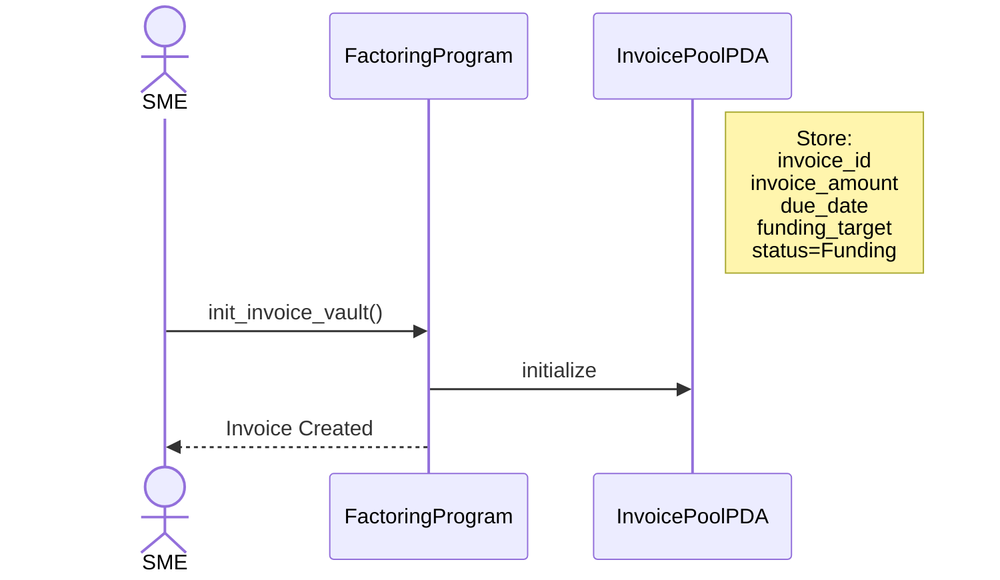
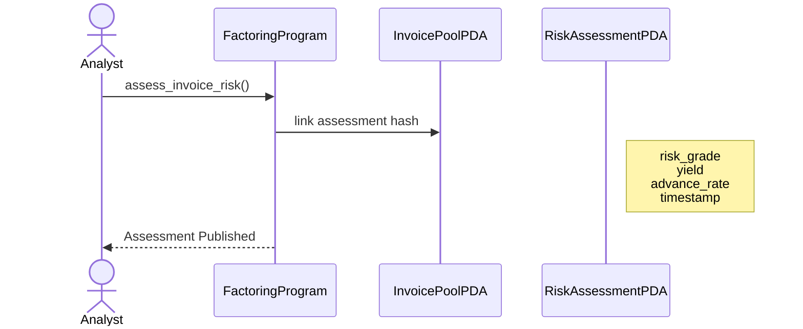
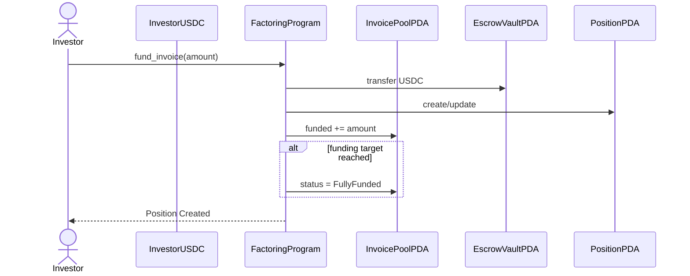
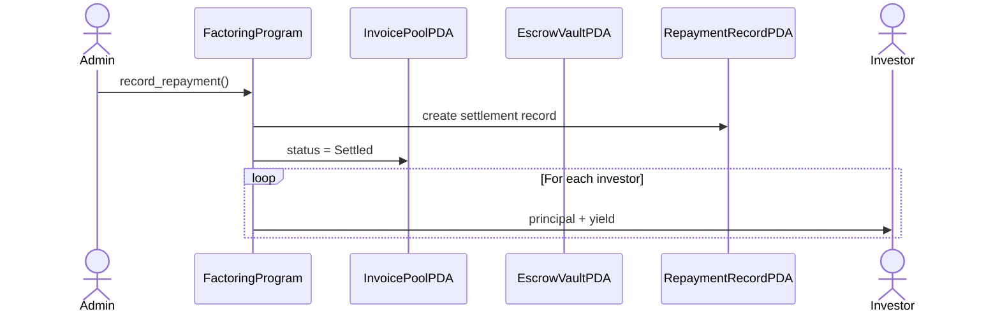

# Factorize

Factorize is a RWA protocol that allow investors to receive up to 18% for receivables of SME (small medium enterprises).

The APY comes from the discount of their receivables at what they sell because of the need of immediate liquidity.

Use cases 

## 4.1 User Story 1 — SME Tokenizes Invoice

## 4.2 User Story 2 — Risk Analyst Publishes Assessment

## 4.3 User Story 3 — Investor Funds Invoice

## 4.4 User Story 4 — Settlement & Yield Distribution

